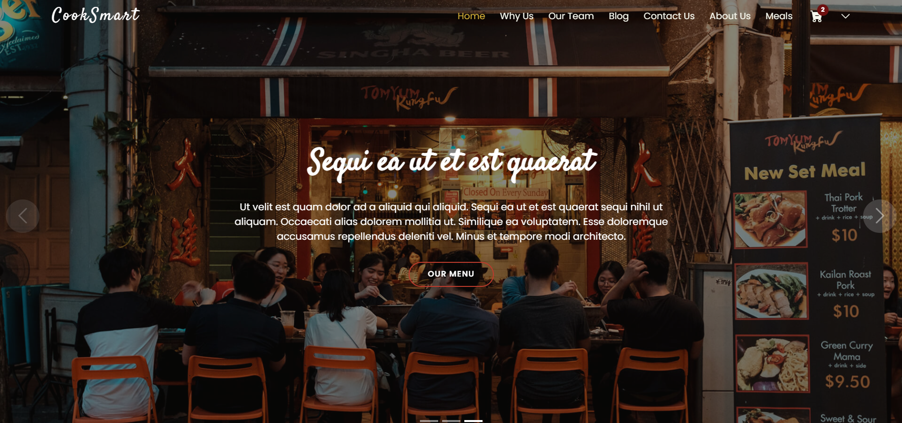

# Meal Planner

  

## INTRODUCTION
User Meal Planner is an Angular-based application that helps users plan, track, and order meals based on their preferences. This application provides a convenient and user-friendly way to manage meals and groceries, allowing users to sign up, log in, browse meals, add them to a cart, and proceed to checkout. Additionally, there is an admin dashboard to create ingredients and meals with these ingredients.
The MealPlanner Managment System has two Roles Like `admin`, and `user`. 

## FEATURES
- Authuntication
- Roles and Perimissions
- Total Revenue of each user orders
- Chart Statistics
- Stripe Payment
- Meal browsing: Users can view a list of available meals.
- Cart management: Users can add meals to their cart and manage the items in the cart.
## Installation

To install and run User Meal Planner locally, follow these steps:

1. Clone the repository:
<pre>
-git clone https://github.com/omar456-asc/MealPlanner
- cd MealPlanner
</pre>
- **BACK-END INSTALLATION**
  <pre>
    - cd backend
    - cp .env-example .env
    - npm install
  </pre>
  Run Back-End Server
  <pre>
    nodemon main.js
  </pre>
- **FRONT-END INSTALLATION**
<pre>
  - cd frontend
  - npm install
  - ng serve -o
</pre>
## Technologies Used

The following technologies were used in the development of User Meal Planner:

- Angular: A front-end web application framework used for building the user interface.
- Node.js: A JavaScript runtime used for server-side development.
- MongoDB: A NoSQL database used for storing and retrieving data efficiently.
- Stripe: A payment processing platform used for secure and seamless payment transactions.
- Express.js: A web application framework for Node.js used for building the server-side application and APIs.
- TypeScript: A typed superset of JavaScript that compiles to plain JavaScript for improved developer productivity and code quality.
- Bootstrap: A popular CSS framework used for responsive and mobile-first web development.

## CLIENT APIs

    
|  METHODS      |         URI              | ACTIONS | 
| :---:         |         :---:            | :---: |   
| POST          | `/api/user/signup`          | `Register` | 
| POST           | `/api/user/login`            | `login` | 
| PUT           | `/api/user/update-data` | `Update data` | 
| PUT           | `/api/user/ `       | `Get all users  ` | 
| DELETE          | `/api/user/:id`           | `Delete a user by ID ` | 
| POST           | `/api/stripe/`           | `Make a payment ` | 
| GET           | `/api/meals/`      | `Get All Meals` | 
| PUT           | `/api/meals/:id`      | `Get meal by ID` | 
| GET        | `/api/meals/search/:key`      | `Search for a meal by keyword` | 
| POST          | `/api/meals/:id`            | `Add a new rating for a meal` | 
| DELETE           | `/api/meals/:id`       | `Delete Meal By ID` | 
| POST           | `/api/meals/`       | `Add a new meal ` | 
| PUT           | `/api/meals/:id`       | `Edit a meal` |   
| GET           | `/api/orders/`       | `Get all orders ` | 
| POST           | `/api/orders/`       | `Create a new order` | 
| GET           | `/api/orders/:id`       | `Get an order by ID` | 
| PUT           | `/api/orders/:id`       | `Update the status of an order` | 
| GET           | `/api/ingredient/`       | `Get all ingredients  ` |
| POST           | `/api/ingredient/`       | `Create a new ingredient` |
| GET           | `/api/ingredient/:id`       | `Get an ingredient by ID` |
| PUT           | `/api/ingredient/:id`       | `Update an ingredient` |
| DELETE           | `/api/ingredient/:id`       | `Delete an ingredient` |
| POST           | `/api/cart/:id`       | `Add an item to the cart ` |
| GET           | `/api/cart/:id`       | `Get the user's cart` |

 

 

## DEMO
🎬
We Hope That You are enjoying Watching Our Demo Video 

## Contributers

- [Sara Hussam](https://github.com/Sarahussam77)
- [Omar Walid](https://github.com/omar456-asc)
- [Sondos Said](https://github.com/Sondos11)
- [Mariam Saad](https://github.com/MariamSMoustafa)
- [Nehad Osman](https://github.com/nehadosman)
- [Mahmoud Mohamed](https://github.com/Mahmoud1499) 
